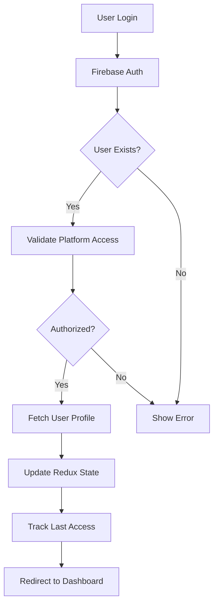

## Overview

TradeMaster Transactions implements a robust authentication system using Firebase Authentication as the primary provider, with Auth0 available as an alternative option. The system includes user validation, role-based access control, and persistent session management.

## Authentication Architecture

### Primary Authentication Flow



## Firebase Authentication

### Firebase Configuration

Firebase is initialized with project-specific credentials:

```js Firebase.js
import firebase from 'firebase/compat/app';
import 'firebase/compat/auth';
import 'firebase/compat/firestore';
import { getFunctions, httpsCallable } from 'firebase/functions';

const firebaseConfig = {
  apiKey: process.env.FIREBASE_API_KEY,
  authDomain: process.env.FIREBASE_AUTH_DOMAIN,
  projectId: process.env.FIREBASE_PROJECT_ID,
  storageBucket: process.env.FIREBASE_STORAGE_BUCKET,
  messagingSenderId: process.env.FIREBASE_MESSAGING_SENDER_ID,
  appId: process.env.FIREBASE_APP_ID
};

const app = firebase.initializeApp(firebaseConfig);
const Auth = firebase.auth();
const Firestore = firebase.firestore();
const functions = getFunctions(app);

export { Auth, Firestore, firebase };
```

<Note>
  The actual configuration values are stored securely and not committed to version control.
</Note>

### Authentication Context Provider

The `AuthProvider` manages authentication state and provides auth methods throughout the application:

```jsx FirebaseContext.js
import { createContext, useEffect } from 'react';
import { firebase, Firestore } from './Firebase';
import { useDispatch } from 'react-redux';
import { authStateChanged } from '../../store/apps/auth/authSlice';

const AuthContext = createContext({
  platform: 'Firebase',
  signup: () => Promise.resolve(),
  signin: () => Promise.resolve(),
  logout: () => Promise.resolve(),
  resetPassword: () => Promise.resolve(),
});

export const AuthProvider = ({ children }) => {
  const dispatch = useDispatch();

  useEffect(() => {
    const unsubscribe = firebase.auth().onAuthStateChanged(async (user) => {
      if (user) {
        // Fetch user profile from Firestore
        const querySnapshot = await Firestore.collection('u_clients')
          .doc(user.uid).get();

        // Validate user status
        if (querySnapshot.data()?.status !== true) {
          logout();
          return;
        }

        // Track user's last access and IP
        const queryIP = await fetch('https://ipapi.co/json/');
        const data = await queryIP.json();

        await Firestore.collection('u_clients').doc(user.uid).update({
          "date.last_access": firebase.firestore.FieldValue.serverTimestamp(),
          last_IP: data.ip
        });

        // Update Redux state
        dispatch(authStateChanged({
          isAuthenticated: true,
          user: {
            uid: user.uid,
            email: user.email,
            avatar: querySnapshot.data()?.image ?? null,
            account_type: querySnapshot.data()?.account_type,
            name: querySnapshot.data()?.name,
            ...querySnapshot.data()
          },
        }));
      } else {
        dispatch(authStateChanged({
          isAuthenticated: false,
          user: null,
        }));
      }
    });

    return () => unsubscribe();
  }, [dispatch]);

  return (
    <AuthContext.Provider value={{...}}>
      {children}
    </AuthContext.Provider>
  );
};
```

### Authentication Methods

#### Email/Password Sign In

```jsx
const signin = (email, password) =>
  firebase.auth().signInWithEmailAndPassword(email, password);
```

#### Email/Password Sign Up

```jsx
const signup = (email, password) =>
  firebase.auth().createUserWithEmailAndPassword(email, password);
```

#### Social Authentication

<Tabs>
  <Tab title="Google">
    ```jsx
    const loginWithGoogle = () => {
      const provider = new firebase.auth.GoogleAuthProvider();
      return firebase.auth().signInWithPopup(provider);
    };
    ```
  </Tab>
  <Tab title="Facebook">
    ```jsx
    const loginWithFaceBook = () => {
      const provider = new firebase.auth.FacebookAuthProvider();
      return firebase.auth().signInWithPopup(provider);
    };
    ```
  </Tab>
  <Tab title="Twitter">
    ```jsx
    const loginWithTwitter = () => {
      const provider = new firebase.auth.TwitterAuthProvider();
      return firebase.auth().signInWithPopup(provider);
    };
    ```
  </Tab>
</Tabs>

#### Password Reset

```jsx
const ResetPassword = (email) =>
  firebase.auth().sendPasswordResetEmail(email);
```

#### Sign Out

```jsx
const logout = () => firebase.auth().signOut();
```

## Login Implementation

The login form implements validation and platform-specific user verification:

```jsx AuthLogin.js
import { useFormik } from 'formik';
import * as Yup from 'yup';
import useAuth from 'src/guards/authGuard/UseAuth';
import { validateUserPlatform } from '../../../guards/firebase/Firebase';
import { toast } from 'react-toastify';

const AuthLogin = () => {
  const { signin } = useAuth();

  const LoginSchema = Yup.object().shape({
    email: Yup.string()
      .email('El correo electrónico es invalido')
      .required('Correo electrónico es requerido'),
    password: Yup.string()
      .min(6, 'La contraseña debe tener al menos 6 caracteres')
      .required('Se requiere contraseña'),
  });

  const formik = useFormik({
    initialValues: {
      email: '',
      password: '',
    },
    validationSchema: LoginSchema,
    onSubmit: async (values, { setErrors, setStatus, setSubmitting }) => {
      try {
        // Validate user has access to the platform
        const resp = await validateUserPlatform({ 
          platform: 'u_clients', 
          email: values.email 
        });

        if (resp.data.valido === true) {
          await signin(values.email, values.password);
          setStatus({ success: true });
        } else {
          toast.error('Usuario no autorizado.');
        }
      } catch (err) {
        const errorMessage = getErrorMessage(err.code);
        toast.error(errorMessage);
        setSubmitting(false);
      }
    },
  });

  const getErrorMessage = (errorCode) => {
    switch (errorCode) {
      case "auth/invalid-email":
        return "La dirección de correo electrónico no es válida.";
      case "auth/invalid-credential":
        return "La contraseña o el correo es incorrecto.";
      case "auth/too-many-requests":
        return "Has echo muchas solicitudes, por favor espera.";
      default:
        return "Ocurrió un error al intentar iniciar sesión.";
    }
  };
};
```

<Warning>
  The platform uses a Cloud Function `validateUserPlatform` to verify that users exist in the correct Firestore collection before allowing authentication.
</Warning>

## Auth0 Integration (Alternative)

Auth0 is available as an alternative authentication provider:

```jsx Auth0Context.js
import { createContext, useEffect, useReducer } from 'react';
import { Auth0Client } from '@auth0/auth0-spa-js';

const auth0Config = {
  client_id: process.env.AUTH0_CLIENT_ID,
  domain: process.env.AUTH0_DOMAIN,
};

let auth0Client;

const initialState = {
  isAuthenticated: false,
  isInitialized: false,
  user: null,
};

const AuthContext = createContext({
  ...initialState,
  method: 'auth0',
  signin: () => Promise.resolve(),
  logout: () => Promise.resolve(),
});

function AuthProvider({ children }) {
  const [state, dispatch] = useReducer(reducer, initialState);

  useEffect(() => {
    const initialize = async () => {
      try {
        auth0Client = new Auth0Client({
          domain: auth0Config.domain,
          clientId: auth0Config.client_id,
          authorizationParams: { 
            redirect_uri: window.location.origin 
          },
        });

        await auth0Client.checkSession();
        const isAuthenticated = await auth0Client.isAuthenticated();

        if (isAuthenticated) {
          const user = await auth0Client.getUser();
          dispatch({
            type: 'INITIALIZE',
            payload: { isAuthenticated, user },
          });
        }
      } catch (err) {
        console.error(err);
        dispatch({
          type: 'INITIALIZE',
          payload: { isAuthenticated: false, user: null },
        });
      }
    };

    initialize();
  }, []);

  const signin = async () => {
    await auth0Client.loginWithPopup();
    const isAuthenticated = await auth0Client.isAuthenticated();

    if (isAuthenticated) {
      const user = await auth0Client.getUser();
      dispatch({ type: 'LOGIN', payload: { user } });
    }
  };

  const logout = () => {
    auth0Client.logout();
    dispatch({ type: 'LOGOUT' });
  };

  return (
    <AuthContext.Provider
      value={{
        ...state,
        method: 'auth0',
        user: {
          id: state?.user?.sub,
          photoURL: state?.user?.picture,
          email: state?.user?.email,
          displayName: state?.user?.name,
        },
        signin,
        logout,
      }}
    >
      {children}
    </AuthContext.Provider>
  );
}
```

<Note>
  To switch to Auth0, update the import in `guards/authGuard/UseAuth.js` to use `Auth0Context` instead of `FirebaseContext`.
</Note>

## Authentication State Management

### Redux Auth Slice

```js authSlice.js
import { createSlice } from '@reduxjs/toolkit';
import moment from 'moment';

const initialState = {
  isAuthenticated: false,
  isInitialized: false,
  user: null,
};

const authSlice = createSlice({
  name: 'auth',
  initialState,
  reducers: {
    authStateChanged(state, action) {
      const { isAuthenticated, user } = action.payload;

      if (user !== null) {
        const convertTimestamp = (timestamp) => {
          if (timestamp && timestamp.seconds) {
            const date = new Date(
              timestamp.seconds * 1000 + 
              timestamp.nanoseconds / 1000000
            );
            return moment(date).format('DD/MM/YYYY - hh:mm:ss a');
          }
          return null;
        };

        user.date.last_update = convertTimestamp(user.date?.last_update);
        user.date.last_access = convertTimestamp(user.date?.last_access);
      }

      state.isAuthenticated = isAuthenticated;
      state.isInitialized = true;
      state.user = user;
    },
  },
});

export const { authStateChanged } = authSlice.actions;
export default authSlice.reducer;
```

### Using Authentication State

```jsx
import useAuth from 'src/guards/authGuard/UseAuth';

function MyComponent() {
  const { user, isAuthenticated, signin, logout } = useAuth();

  if (!isAuthenticated) {
    return <div>Please log in</div>;
  }

  return (
    <div>
      <h1>Welcome, {user.name}</h1>
      <p>Role: {user.account_type}</p>
      <button onClick={logout}>Sign Out</button>
    </div>
  );
}
```

## Route Protection

### Auth Guard

Protects routes that require authentication:

```jsx AuthGuard.js
import { useNavigate } from 'react-router-dom';
import useAuth from './UseAuth';
import { useEffect } from 'react';

const AuthGuard = ({ children }) => {
  const { isAuthenticated } = useAuth();
  const navigate = useNavigate();

  useEffect(() => {
    if (!isAuthenticated) {
      navigate('/auth/login', { replace: true });
    }
  }, [isAuthenticated, navigate]);

  return children;
};

export default AuthGuard;
```

### Guest Guard

Prevents authenticated users from accessing public routes:

```jsx GuestGuard.js
import { useNavigate } from 'react-router-dom';
import useAuth from './UseAuth';
import { useEffect } from 'react';

const GuestGuard = ({ children }) => {
  const { isAuthenticated } = useAuth();
  const navigate = useNavigate();

  useEffect(() => {
    if (isAuthenticated) {
      navigate('/', { replace: true });
    }
  }, [isAuthenticated, navigate]);

  return children;
};
```

### Permission Guard

Enforces role-based permissions using CASL:

```jsx PermissionGuard.js
import { Can } from '@casl/react';
import { useNavigate } from 'react-router-dom';
import { useAbility } from '../contexts/AbilityContext';

const PermissionGuard = ({ action, subject, children }) => {
  const ability = useAbility();
  const navigate = useNavigate();

  return (
    <Can I={action} a={subject} ability={ability}>
      {(allowed) =>
        allowed ? children : navigate('/auth/permissions', { replace: true })
      }
    </Can>
  );
};
```

## Session Management

### Persistent Sessions

Authentication state is persisted using Redux Persist:

```js
const persistConfig = {
  key: 'root',
  storage,
  whitelist: ['auth', 'customizer', 'setup']
};
```

### Session Tracking

Each authentication event updates user tracking data:

<Steps>
  <Step title="User Login">
    Firebase auth state listener detects authentication
  </Step>
  <Step title="IP Detection">
    Fetch user's IP address from ipapi.co
  </Step>
  <Step title="Firestore Update">
    Update `last_access` timestamp and `last_IP` in Firestore
  </Step>
  <Step title="State Sync">
    Dispatch updated user data to Redux store
  </Step>
</Steps>

### Auto-logout on Status Change

Users are automatically logged out if their account status changes:

```jsx
if (querySnapshot.data()?.status !== true) {
  logout();
}
```

## User Profile Management

### Updating User Profile

```jsx
const UpdateUser = (oldUser, newUser) => {
  dispatch(authStateChanged({
    isAuthenticated: true,
    user: {
      id: oldUser.id,
      account_type: oldUser.account_type,
      avatar: newUser.image ?? oldUser.avatar,
      ...newUser,
    },
  }));
};
```

### User Data Structure

```typescript
interface User {
  uid: string;
  email: string;
  name: string;
  avatar?: string;
  account_type: 'Administrador' | 'Cliente' | 'Coordinador' | 'Contador' | 'Soporte';
  phone?: string;
  address?: {
    line: string;
    zipcode: string;
    city: string;
    country: object;
  };
  status: boolean;
  date: {
    created: string;
    last_update: string;
    last_access: string;
  };
  last_IP: string;
  country_calling_code: string;
}
```

## Security Best Practices

<AccordionGroup>
  <Accordion title="Platform Validation">
    All login attempts validate against the `u_clients` collection using a Cloud Function to prevent unauthorized access.
  </Accordion>
  
  <Accordion title="Status Verification">
    User accounts have a `status` field that must be `true` for authentication to succeed.
  </Accordion>
  
  <Accordion title="IP Tracking">
    Each login is tracked with IP address and timestamp for security auditing.
  </Accordion>
  
  <Accordion title="Route Protection">
    Multi-layered guards ensure only authenticated and authorized users access protected routes.
  </Accordion>
</AccordionGroup>

## Common Authentication Flows

### Standard Login Flow

```jsx
// 1. User submits login form
await validateUserPlatform({ platform: 'u_clients', email });

// 2. If validated, sign in with Firebase
await signin(email, password);

// 3. Firebase auth listener triggers
firebase.auth().onAuthStateChanged(async (user) => {
  // 4. Fetch user profile from Firestore
  const profile = await Firestore.collection('u_clients').doc(user.uid).get();
  
  // 5. Verify status
  if (profile.data()?.status !== true) {
    logout();
    return;
  }
  
  // 6. Track access
  await Firestore.collection('u_clients').doc(user.uid).update({
    "date.last_access": firebase.firestore.FieldValue.serverTimestamp(),
  });
  
  // 7. Update Redux state
  dispatch(authStateChanged({ isAuthenticated: true, user: profile.data() }));
});
```

### Password Reset Flow

```jsx
// 1. User requests password reset
await ResetPassword(email);

// 2. Firebase sends email with reset link
// 3. User clicks link and resets password
// 4. User can now login with new password
```

## Error Handling

### Common Authentication Errors

<ResponseField name="auth/invalid-email" type="error">
  The email address is badly formatted
</ResponseField>

<ResponseField name="auth/invalid-credential" type="error">
  The password or email is incorrect
</ResponseField>

<ResponseField name="auth/too-many-requests" type="error">
  Too many failed login attempts
</ResponseField>

<ResponseField name="auth/user-disabled" type="error">
  The user account has been disabled
</ResponseField>

## Next Steps

<CardGroup cols={2}>
  <Card title="Permissions" icon="shield" href="/admin/permissions">
    Learn about CASL-based role and permission system
  </Card>
  <Card title="Redux Store" icon="database" href="/api/redux-store">
    Explore Redux state management and auth slice
  </Card>
  <Card title="User Components" icon="users" href="/api/components/user-components">
    Discover user management components
  </Card>
  <Card title="Overview" icon="book" href="/api/overview">
    Review the complete API architecture
  </Card>
</CardGroup>