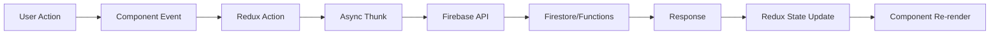

## Introduction

TradeMaster Transactions (TMT) is a comprehensive event ticketing and management platform built with React 18, Redux Toolkit, and Firebase. The application provides a complete solution for managing events, venues, tickets, transactions, and user roles across multiple organizational levels.

## Technology Stack

The platform is built using modern web technologies:

<CardGroup cols={2}>
  <Card title="Frontend Framework" icon="react">
    React 18.3.1 with functional components and hooks
  </Card>
  <Card title="State Management" icon="database">
    Redux Toolkit with Redux Persist
  </Card>
  <Card title="Backend Services" icon="fire">
    Firebase (Authentication, Firestore, Cloud Functions)
  </Card>
  <Card title="UI Framework" icon="palette">
    Material-UI (MUI) v5 with custom theming
  </Card>
</CardGroup>

## Application Architecture

### Entry Point

The application bootstraps in `main.jsx` with several key providers:

```jsx main.jsx
import { Provider } from "react-redux";
import { BrowserRouter } from "react-router-dom";
import { PersistGate } from 'redux-persist/integration/react';
import { AuthProvider } from "src/guards/firebase/FirebaseContext";
import store, { persistor } from "./store/Store";

ReactDOM.createRoot(document.getElementById("root")).render(
  <Provider store={store}>
    <Suspense fallback={<Spinner />}>
      <PersistGate loading={null} persistor={persistor}>
        <BrowserRouter>
          <ToastContainer />
          <AuthProvider>
            <App />
          </AuthProvider>
        </BrowserRouter>
      </PersistGate>
    </Suspense>
  </Provider>
);
```

### Core Application Flow

The main `App.jsx` component orchestrates the application:

```jsx App.jsx
import { useRoutes } from 'react-router-dom';
import useAuth from 'src/guards/authGuard/UseAuth';
import { AbilityContext } from './guards/contexts/AbilityContext';
import { defineAbilitiesFor } from './guards/contexts/DefineAbilities';

function App() {
  const { user } = useAuth();
  const ability = defineAbilitiesFor(user);
  const routing = useRoutes(Router);
  const theme = ThemeSettings();
  const customizer = useSelector((state) => state.customizer);

  React.useEffect(() => {
    ability.update(defineAbilitiesFor(user).rules);
  }, [user]);

  return (
    <ThemeProvider theme={theme}>
      <AbilityContext.Provider value={ability}>
        <RTL direction={customizer.activeDir}>
          <CssBaseline />
          <ScrollToTop>{routing}</ScrollToTop>
        </RTL>
      </AbilityContext.Provider>
    </ThemeProvider>
  );
}
```

## Routing Architecture

The application uses React Router v6 with a centralized routing configuration in `routes/Router.js`:

### Route Protection Layers

<Steps>
  <Step title="Authentication Guard">
    `AuthGuard` protects all authenticated routes, redirecting unauthenticated users to login
  </Step>
  <Step title="Permission Guard">
    `PermissionGuard` uses CASL for fine-grained role-based access control
  </Step>
  <Step title="Guest Guard">
    `GuestGuard` prevents authenticated users from accessing public routes like login
  </Step>
</Steps>

### Route Structure

```jsx Router.js
const Router = [
  {
    path: '/',
    element: (
      <AuthGuard>
        <FullLayout />
      </AuthGuard>
    ),
    children: [
      { path: '/', element: <Navigate to="/dashboards/modern" /> },
      { 
        path: '/dashboards/modern', 
        exact: true, 
        element: <ModernDash /> 
      },
      { 
        path: '/usuarios-staff', 
        element: (
          <PermissionGuard action="view" subject="ViewStaff">
            <StaffTable />
          </PermissionGuard>
        ) 
      },
      // Additional protected routes...
    ],
  },
  {
    path: '/auth',
    element: (
      <GuestGuard>
        <BlankLayout />
      </GuestGuard>
    ),
    children: [
      { path: '/auth/login', element: <Login /> },
      { path: '/auth/forgot-password', element: <ForgotPassword /> },
      { path: '/auth/register', element: <Register /> },
    ],
  },
];
```

## State Management

### Redux Store Configuration

The application uses Redux Toolkit with persistence for key state slices:

```js Store.js
import { configureStore } from '@reduxjs/toolkit';
import { persistReducer, persistStore } from 'redux-persist';
import storage from 'redux-persist/lib/storage';

const persistConfig = {
  key: 'root',
  storage,
  whitelist: ['auth', 'customizer', 'setup']
};

const rootReducer = combineReducers({
  auth: authReducer,
  customizer: CustomizerReducer,
  setup: SetupReducer,
  staff: StaffReducer,
  clients: ClientsReducer,
  events: EventsReducer,
  tickets: TicketReducer,
  transactions: TransactionsReducer,
  // ... additional reducers
});

const persistedReducer = persistReducer(persistConfig, rootReducer);

export const store = configureStore({
  reducer: persistedReducer,
  middleware: (getDefaultMiddleware) =>
    getDefaultMiddleware({
      serializableCheck: {
        ignoredActions: [FLUSH, REHYDRATE, PAUSE, PERSIST, PURGE, REGISTER],
      },
    }),
});
```

### Redux Slice Pattern

All feature modules follow a consistent slice pattern with async thunks:

```js EventsSlice.js
import { createSlice } from '@reduxjs/toolkit';
import { Firestore } from '../../../guards/firebase/Firebase';

const initialState = {
  Events: [],
  ActiveEvents: [],
  ClientEvents: [],
  EventsSearch: '',
  error: ''
};

export const EventsSlice = createSlice({
  name: 'Events',
  initialState,
  reducers: {
    hasError(state, action) {
      state.error = action.payload;
    },
    getEvents: (state, action) => {
      state.Events = action.payload;
    },
    getActiveEvents: (state, action) => {
      state.ActiveEvents = action.payload;
    },
  },
});

// Async thunk for fetching events
export const fetchEvents = (id) => async (dispatch) => {
  try {
    const querySnapshot = id 
      ? await Firestore.collection('events').where("venue_id", "==", id).get() 
      : await Firestore.collection('events').get();

    const EventsArray = querySnapshot.docs.map((doc) => ({
      id: doc.id,
      ...doc.data()
    }));

    dispatch(getEvents(EventsArray));
  } catch (error) {
    dispatch(hasError(error));
  }
};
```

## Component Architecture

### Layout System

The application uses two primary layouts:

<CodeGroup>
```text Full Layout (Authenticated)
├── Header/Navigation
├── Sidebar
├── Main Content Area
│   └── Dynamic Route Components
└── Footer
```

```text Blank Layout (Public)
└── Main Content Area
    └── Authentication Forms
```
</CodeGroup>

### Component Organization

```text
src/
├── components/
│   ├── apps/              # Feature-specific components
│   │   ├── events/
│   │   ├── tickets/
│   │   ├── portals/
│   │   └── contracts/
│   ├── forms/             # Form elements
│   └── shared/            # Reusable components
├── views/                 # Page-level components
│   ├── authentication/
│   ├── dashboard/
│   ├── events/
│   └── Users/
├── layouts/               # Layout components
│   ├── full/
│   └── blank/
└── guards/                # Auth and permission logic
```

## Permission System (CASL)

The platform implements role-based access control using CASL:

<Tabs>
  <Tab title="Roles">
    - **Administrador**: Full system access
    - **Cliente**: Client-level access
    - **Coordinador**: Event coordination permissions
    - **Contador**: Financial/accounting access
    - **Soporte**: Support team permissions
  </Tab>
  <Tab title="Implementation">
    ```js DefineAbilities.js
    import { AbilityBuilder, Ability } from '@casl/ability';

    export function defineAbilitiesFor(user) {
      const { can, cannot, build } = new AbilityBuilder(Ability);

      if (user.account_type === 'Administrador') {
        can('manage', 'all');
      } else if (user.account_type === 'Coordinador') {
        can(['view', 'create', 'edit'], 'events');
        can(['view'], 'ViewStaff');
        cannot(['create', 'edit'], 'usersStaff');
      }

      return build();
    }
    ```
  </Tab>
</Tabs>

## Data Flow Patterns

### Typical Data Flow



### Example: Fetching and Displaying Events

<Steps>
  <Step title="Component Mount">
    Component calls dispatch with async thunk
  </Step>
  <Step title="Firestore Query">
    Thunk executes Firestore query
  </Step>
  <Step title="Data Transformation">
    Response data is transformed (timestamps, etc.)
  </Step>
  <Step title="State Update">
    Redux state is updated via reducer
  </Step>
  <Step title="Component Update">
    Component receives updated state via useSelector
  </Step>
</Steps>

## Key Dependencies

<AccordionGroup>
  <Accordion title="Core Dependencies">
    - `react` v18.3.1 - UI framework
    - `react-router-dom` v6.3.0 - Routing
    - `@reduxjs/toolkit` v1.8.3 - State management
    - `firebase` v9.5.0 - Backend services
  </Accordion>
  
  <Accordion title="UI & Styling">
    - `@mui/material` v5.10.16 - Component library
    - `@emotion/react` & `@emotion/styled` - CSS-in-JS
    - `@tabler/icons` - Icon library
  </Accordion>
  
  <Accordion title="Form & Validation">
    - `formik` v2.2.9 - Form management
    - `yup` v0.32.11 - Schema validation
  </Accordion>
  
  <Accordion title="Authorization">
    - `@casl/ability` v6.7.1 - Permission management
    - `@auth0/auth0-spa-js` v2.1.3 - Auth0 integration (alternative)
  </Accordion>
</AccordionGroup>

## API Communication

### Firebase Integration

The platform primarily uses Firebase services:

- **Authentication**: User authentication and session management
- **Firestore**: Real-time database for all application data
- **Cloud Functions**: Server-side logic (httpsCallable functions)
- **Storage**: File and image storage

### HTTP Callable Functions

Server-side operations are handled via Firebase Cloud Functions:

```js Firebase.js
import { getFunctions, httpsCallable } from 'firebase/functions';

const functions = getFunctions(app);

export const create_staff = httpsCallable(functions, 'create_staff');
export const create_client = httpsCallable(functions, 'create_client');
export const tickets_generate = httpsCallable(functions, 'tickets_generate');
export const validateUserPlatform = httpsCallable(functions, 'validate_user_platform');
```

## Development Patterns

### Lazy Loading

All route components are lazy-loaded for optimal performance:

```jsx
import { lazy } from 'react';
import Loadable from '../layouts/full/shared/loadable/Loadable';

const ModernDash = Loadable(lazy(() => import('../views/dashboard/Modern')));
const EventsList = Loadable(lazy(() => import('../views/events/list-events/EventsList')));
```

### Custom Hooks

The application provides custom hooks for common operations:

- `useAuth()` - Access authentication context
- `useMounted()` - Track component mount state

### Error Handling

Consistent error handling with toast notifications:

```jsx
import { toast } from 'react-toastify';

try {
  await someAsyncOperation();
  toast.success('Operation successful');
} catch (error) {
  toast.error(errorMessages[error.code] ?? 'An error occurred');
}
```

## Next Steps

<CardGroup cols={2}>
  <Card title="Authentication" icon="lock" href="/api/authentication">
    Learn about Firebase authentication, Auth0 integration, and session management
  </Card>
  <Card title="Redux Store" icon="database" href="/api/redux-store">
    Explore Redux store configuration and persistence
  </Card>
  <Card title="Redux Slices" icon="code" href="/api/slices">
    Discover all Redux slices and their state management patterns
  </Card>
  <Card title="Components" icon="puzzle-piece" href="/api/components/user-components">
    Deep dive into React components and their APIs
  </Card>
</CardGroup>